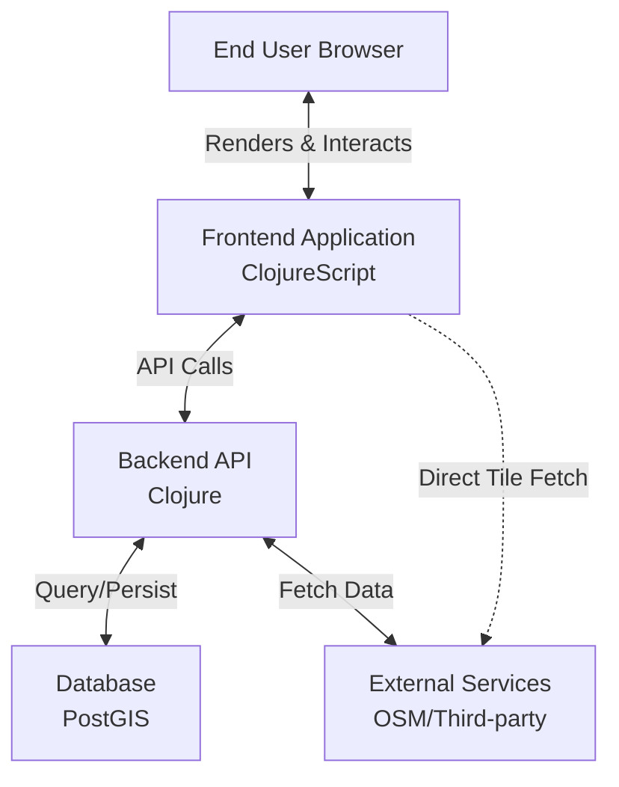

# Pearl-Map: 3D Web Mapping Platform 🌍

[English](README.md) | [中文](README_zh.md)

A high-performance, customizable 3D web mapping application built with Clojure and ClojureScript. Renders vector tiles and 3D terrain using MapLibre GL, powered by OpenStreetMap data, featuring a real-time style editor for dynamic visual customization.

## 📖 Overview

Pearl-Map delivers an immersive 3D geospatial visualization experience, enabling users to explore, analyze, and present location-based data through an intuitive interface. The platform combines powerful rendering capabilities with advanced customization tools.

## 🏗️ Architecture

### 1. Business Architecture

**Core Value Proposition**
Provide a high-performance, customizable 3D geospatial visualization platform that enables intuitive exploration, analysis, and presentation of location-based data.

**Key Capabilities**
- **🗺️ 3D Map Core Experience**: Fluid navigation (pan, zoom, tilt, rotate), 3D terrain rendering, building extrusion, and custom 3D model integration
- **🎨 Dynamic Style Editor**: Real-time visual customization through UI controls and code editor with live preview and theme sharing
- **📊 Data Integration & Visualization**: Seamless OpenStreetMap integration with support for GeoJSON and API-based geodata
- **🔍 Analysis & Querying**: Spatial feature querying, measurement tools, and future support for advanced spatial analysis

**User Roles**
- **👀 End Viewer**: Explore pre-configured maps and visualizations
- **✏️ Map Editor/Analyst**: Create and customize map views using style editing and data integration tools
- **⚙️ Administrator**: Manage users, system configuration, and backend services

### 2. Application Architecture

**Architecture Style**: Decoupled frontend-backend architecture

**Frontend (Single-Page Application)**
- **Technology Stack**: ClojureScript, Reagent, re-frame
- **Responsibilities**:
  - UI rendering using React/Reagent components
  - State management through unified app-db
  - Map rendering via MapLibre GL JS
  - Style editing with Monaco Editor integration
  - API communication through HTTP calls

**Backend (API Server)**
- **Technology Stack**: Clojure, Ring, Reitit, Integrant
- **Responsibilities**:
  - RESTful API gateway
  - Business logic and spatial query processing
  - Data access via PostgreSQL/PostGIS with next.jdbc
  - OSM integration and external service proxying

**Data Flow**


### 3. Technology Stack

| Component | Technology | Rationale |
|-----------|------------|-----------|
| **Frontend Framework** | ClojureScript, Reagent, re-frame | Immutable data flow for complex UI state, functional programming for maintainability |
| **Map Rendering** | MapLibre GL JS | Open-source WebGL support with 3D features and custom styling |
| **Style Editor** | Monaco Editor | Professional code editing experience for style JSON |
| **HTTP Client** | cljs-ajax/fetch | Robust API communication |
| **Frontend Build Tool** | shadow-cljs | Superior development experience with hot-reload and NPM integration |
| **Backend Build Tool** | deps.edn (Clojure CLI) | Official toolchain, lightweight and flexible, integrates well with shadow-cljs |
| **Backend Framework** | Clojure, Ring, Reitit, Integrant | High-performance JVM runtime with robust web stack |
| **Data Storage** | PostgreSQL + PostGIS | Industry standard for spatial data processing |
| **Data Formats** | JSON, EDN, MVT | Universal compatibility with native Clojure support |
| **Authentication** | Buddy | Mature security library with JWT support |
| **Deployment** | Docker, Nginx, JDK | Containerized environments for consistency |
| **Version Control** | Git | Standard version control system |

### Development Environment Setup

**Prerequisites**
- Java Development Kit (JDK) 11+
- Node.js 14+
- npm or yarn

**Installation Steps**
1. Install Clojure CLI tools
2. Install project dependencies:
   ```bash
   # Install JavaScript dependencies
   npm install
   ```
3. Start development environment:
   ```bash
   # Start frontend build and hot-reload
   npm run dev

   # Start backend REPL in another terminal
   clj -M:dev

   # Start static file server (for development)
   npm run serve
   ```

**Building for Production**
```bash
# Build frontend resources
npm run build

# Build backend Uberjar (requires additional configuration)
```

### 4. Development Roadmap

**Phase-Driven Strategy**: Focused on rapid validation, iterative enhancement, and strategic expansion

#### Phase 1: Web Application Foundation (Core MVP)
- **🌐 Browser-based SPA**: Full-featured single-page application
- **🏔️ 3D Viewing & Basic Editor**: Core 3D visualization with essential editing capabilities
- **📱 PWA Foundation**: Progressive Web App infrastructure setup

#### Phase 2: Product Enhancement (Enhanced PWA)
- **📴 Offline Support & Installation**: Enable offline usage and app installation
- **⚡ Performance Optimization**: Enhance loading speeds and rendering performance
- **🔬 Advanced Analysis Tools**: Add sophisticated spatial analysis capabilities

#### Phase 3: Cross-Platform Expansion (Platform Expansion)
- **🔌 API-First Platform**: Develop comprehensive API for third-party integration
- **📱 Mobile Hybrid Applications**: Extend to iOS and Android using hybrid approaches
- **💻 Desktop Applications**: Native desktop application versions

**Visual Flow**: Phase 1 → Phase 2 → Phase 3

Each phase builds upon the previous work, ensuring continuous enhancement and expansion of capabilities.

## 🎯 Conclusion

This development strategy follows a low-risk, high-iteration-speed approach. Each phase builds upon previous work, maximizing code reuse and leveraging the full potential of the Clojure/Script ecosystem. The hybrid mobile approach in Phase 3 provides the most efficient path to cross-platform presence.
