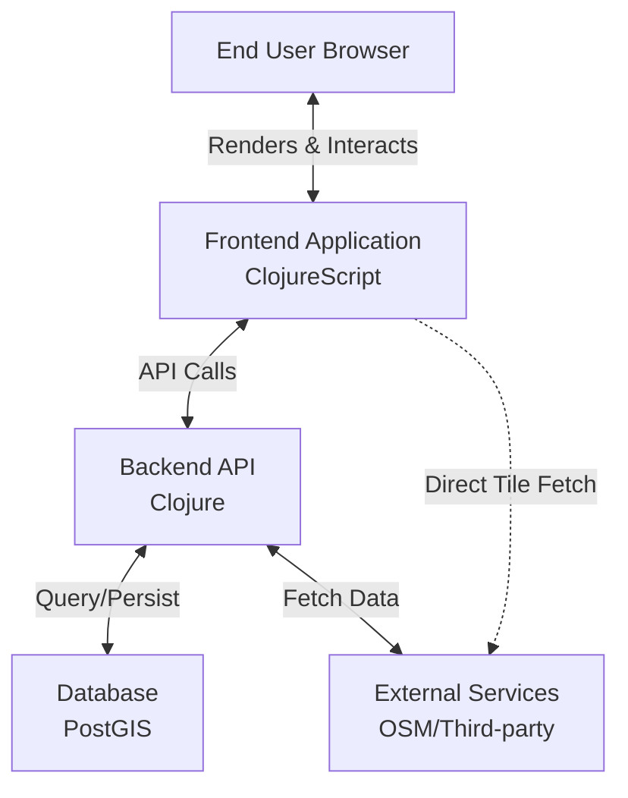
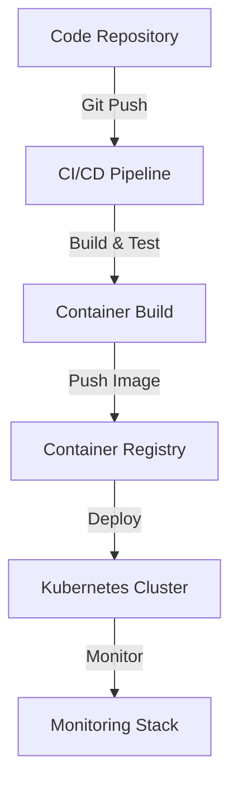

# Pearl-Map: 3D Web Mapping Platform 🌍

[English](README.md) | [中文](README_zh.md)

A high-performance, customizable 3D web mapping application built with Clojure and ClojureScript. Renders vector tiles and 3D terrain using MapLibre GL, powered by OpenStreetMap data, featuring a real-time style editor for dynamic visual customization.

## 📖 Overview

Pearl-Map delivers an immersive 3D geospatial visualization experience, enabling users to explore, analyze, and present location-based data through an intuitive interface. The platform combines powerful rendering capabilities with advanced customization tools.

## 📁 Project Structure

```
pearl-map/
├── .github/                                 # GitHub workflows and CI/CD configuration
│   └── workflows/                           # CI/CD pipeline definitions
│       ├── ci.yml                           # Continuous integration workflow [TO BE CREATED]
│       ├── cd.yml                           # Continuous deployment workflow [TO BE CREATED]
│       └── release.yml                      # Release automation workflow [TO BE CREATED]
├── bin/                                     # Executable scripts
│   ├── setup-dev                            # Development environment setup script [TO BE CREATED]
│   ├── deploy-prod                          # Production deployment script [TO BE CREATED]
│   └── backup-db                            # Database backup script [TO BE CREATED]
├── dev/                                     # Development environment configuration
│   └── user.clj                             # User configuration for development [TO BE CREATED]
├── doc/                                     # Project documentation
│   ├── deployment.md                        # Deployment guide [TO BE CREATED]
│   ├── api.md                               # API documentation [TO BE CREATED]
│   ├── architecture.md                      # Architecture overview [TO BE CREATED]
│   └── contributing.md                      # Contribution guidelines [TO BE CREATED]
├── infrastructure/                          # Infrastructure as Code [TO BE CREATED]
│   ├── modules/                             # Terraform modules
│   │   ├── network/                         # VPC, subnets, security groups
│   │   ├── database/                        # RDS/Cloud SQL with PostGIS
│   │   ├── kubernetes/                      # EKS/GKE cluster configuration
│   │   ├── storage/                         # Object storage buckets
│   │   └── monitoring/                      # Monitoring stack resources
│   └── environments/                        # Environment configurations
│       ├── dev/                             # Development environment
│       ├── staging/                         # Staging environment
│       └── prod/                            # Production environment
├── src/                                     # Source code
│   ├── clj/                                 # Backend Clojure code [TO BE CREATED]
│   │   └── pearl_map/                       # Main namespace
│   │       ├── core.clj                     # Core functionality [TO BE CREATED]
│   │       ├── api/                         # API handlers
│   │       │   ├── handlers.clj             # Request handlers [TO BE CREATED]
│   │       │   └── routes.clj               # API routes [TO BE CREATED]
│   │       ├── db/                          # Database layer
│   │       │   ├── core.clj                 # Database core [TO BE CREATED]
│   │       │   └── queries.clj              # Database queries [TO BE CREATED]
│   │       ├── config/                      # Configuration management
│   │       │   └── config.clj               # Configuration handling [TO BE CREATED]
│   │       ├── middleware/                  # Middleware
│   │       │   ├── auth.clj                 # Authentication middleware [TO BE CREATED]
│   │       │   ├── cors.clj                 # CORS middleware [TO BE CREATED]
│   │       │   └── logging.clj              # Logging middleware [TO BE CREATED]
│   │       └── main.clj                     # Application entry point [TO BE CREATED]
│   ├── pearl_map/                           # Build utilities namespace
│   │   └── build.clj                        # Build tasks and utilities [EXISTS]
│   └── cljs/                                # Frontend ClojureScript code
│       └── pearl_map/                       # Frontend main namespace
│           ├── core.cljs                    # Frontend core [EXISTS]
│           ├── editor.cljs                  # Style editor component [EXISTS]
│           ├── events.cljs                  # re-frame events [TO BE CREATED]
│           ├── subs.cljs                    # re-frame subscriptions [TO BE CREATED]
│           ├── views/                       # React components
│           │   ├── map.cljs                 # Map component [TO BE CREATED]
│           │   ├── editor.cljs              # Style editor component [EXISTS]
│           │   ├── ui.cljs                  # UI components [TO BE CREATED]
│           │   └── layout.cljs              # Layout components [TO BE CREATED]
│           ├── api.cljs                     # API client [TO BE CREATED]
│           └── services/                    # Frontend services
│               ├── map_engine.cljs          # Map engine wrapper [TO BE CREATED]
│               └── threejs.cljs             # Three.js integration [TO BE CREATED]
├── resources/                               # Source resource files (git tracked)
│   ├── config/                              # Configuration files [TO BE CREATED]
│   │   ├── config.edn                       # Base configuration [TO BE CREATED]
│   │   ├── dev.edn                          # Development configuration [TO BE CREATED]
│   │   └── prod.edn                         # Production configuration [TO BE CREATED]
│   ├── public/                              # Static source assets
│   │   ├── index.html                       # HTML template [EXISTS]
│   │   ├── css/                             # CSS source styles
│   │   │   ├── maplibre-gl.css              # MapLibre styles [EXISTS]
│   │   │   └── style.css                    # Main stylesheet [EXISTS]
│   │   └── models/                          # 3D model source assets [PARTIALLY IMPLEMENTED]
│   │       └── eiffel_tower/                # Eiffel Tower 3D model directory [EXISTS]
│   │           ├── license.txt              # Model license [EXISTS]
│   │           ├── scene.bin                # Model binary file [EXISTS]
│   │           └── scene.gltf               # Model GLTF file [EXISTS]
│   ├── sql/                                 # Database scripts [TO BE CREATED]
│   │   └── migrations/                      # Database migrations
│   │       ├── 001-initial-schema.sql       # Initial database schema [TO BE CREATED]
│   │       └── 002-add-spatial-data.sql     # Spatial data migration [TO BE CREATED]
│   └── data/                                # Sample data [TO BE CREATED]
│       ├── sample-geojson/                  # GeoJSON sample data
│       │   └── paris-landmarks.geojson      # Paris landmarks sample [TO BE CREATED]
│       └── map-styles/                      # Map style examples
│           ├── dark-style.json              # Dark theme style [TO BE CREATED]
│           └── light-style.json             # Light theme style [TO BE CREATED]
├── test/                                    # Test code [TO BE CREATED]
│   ├── clj/                                 # Backend tests
│   │   └── pearl_map/                       # Test namespace
│   │       ├── api/                         # API tests
│   │       │   └── handlers_test.clj        # Handler tests [TO BE CREATED]
│   │       ├── db/                          # Database tests
│   │       │   └── core_test.clj            # Database core tests [TO BE CREATED]
│   │       └── integration/                 # Integration tests
│   │           └── api_integration_test.clj # API integration tests [TO BE CREATED]
│   └── cljs/                                # Frontend tests
│       └── pearl_map/                       # Frontend test namespace
│           ├── components/                  # Component tests
│           │   └── map_test.cljs            # Map component tests [TO BE CREATED]
│           └── services/                    # Service tests
│               └── map_engine_test.cljs     # Map engine tests [TO BE CREATED]
├── target/                                  # Final build output & compiled assets for release (excluded from git)
├── .gitignore                               # Git ignore rules [EXISTS]
├── .editorconfig                            # Editor configuration [TO BE CREATED]
├── .nvmrc                                   # Node.js version [EXISTS]
├── deps.edn                                 # Clojure dependencies [EXISTS]
├── package.json                             # JavaScript dependencies [EXISTS]
├── shadow-cljs.edn                          # ClojureScript build configuration [EXISTS]
├── docker-compose.yml                       # Docker development environment [TO BE CREATED]
├── Dockerfile                               # Production Dockerfile [TO BE CREATED]
├── Makefile                                 # Build scripts [TO BE CREATED]
├── CHANGELOG.md                             # Change log [TO BE CREATED]
├── README.md                                # Project documentation (English) [EXISTS]
└── README_zh.md                             # Project documentation (Chinese) [EXISTS]
```

### Key Configuration Files

- **`deps.edn`**: Clojure backend dependency management and build configuration
- **`shadow-cljs.edn`**: ClojureScript frontend build and compilation configuration
- **`package.json`**: JavaScript dependencies and NPM scripts configuration
- **`src/pearl_map/build.clj`**: Build tasks and utilities for the application
- **`.gitignore`**: Git ignore rules for the project

### Initial Implementation Status

The initial implementation focuses on Phase 1 of the development roadmap, specifically the Paris-focused MVP:

**Core Features Implemented:**
- ✅ Basic React/Reagent component structure with home page
- ✅ MapLibre GL JS integration with multiple style support
- ✅ Eiffel Tower coordinates pre-configured as center point (2.2945°E, 48.8584°N)
- ✅ Responsive map container with proper styling
- ✅ Map instance state management using Reagent atoms
- ✅ Style switching functionality (Basic/Dark/Light styles)
- ✅ Navigation controls integration
- ✅ Scale control integration
- ✅ Error handling and debugging utilities
- ✅ OSM raster tiles integration with German mirror support
- ✅ Real-time building style editor with color and opacity adjustments
- ✅ Automatic building layer detection and style application
- ✅ Real-time preview functionality
- ✅ Hot-reload support for development environment
- ✅ Eiffel Tower 3D model loading (GLTF format) - MODEL LOADED
- ✅ Three.js rendering infrastructure setup
- ✅ Custom CSS styling for UI components
- ✅ MapLibre CSS integration

**Current Technical Status:**
- Map centered at Eiffel Tower coordinates with zoom level 15, 45° pitch angle
- Support for multiple map styles:
  - ✅ Basic Style: OpenStreetMap raster tiles (German mirror) - WORKING
  - ✅ Dark Style: Carto Dark Matter vector tiles - WORKING (with building style editing)
  - ✅ Light Style: Carto Positron vector tiles - WORKING (with building style editing)
- Building style editor provides real-time preview functionality
- Support for real-time adjustments of fill color, outline color, and opacity
- One-click switching between light and dark themes
- Complete debugging tools and layer information viewing
- Hot-reload support for development environment
- Eiffel Tower 3D model integration (GLTF format) - LOADED (Three.js rendering infrastructure in place)
- Custom CSS styling for UI components - IMPLEMENTED
- MapLibre CSS integration - IMPLEMENTED

**File Structure Added:**
```
src/
├── cljs/pearl_map/
│   ├── core.cljs              # Main application entry point with complete map functionality
│   ├── editor.cljs            # Building style editor component (IMPLEMENTED)
│   └── (other files to be added)
└── pearl_map/
    └── build.clj              # Build tasks and utilities (IMPLEMENTED)
resources/
├── public/
│   ├── css/
│   │   ├── maplibre-gl.css    # MapLibre styles (IMPLEMENTED)
│   │   └── style.css          # Custom styles (IMPLEMENTED)
│   ├── index.html             # HTML template (IMPLEMENTED)
│   └── models/
│       └── eiffel_tower/      # Eiffel Tower 3D model (IMPLEMENTED)
│           ├── license.txt    # Model license (IMPLEMENTED)
│           ├── scene.bin      # Model binary (IMPLEMENTED)
│           └── scene.gltf     # Model GLTF (IMPLEMENTED)
```

**Next Steps:**
- Next: Add 3D model integration for Eiffel Tower (GLTF)
- Next: Enhance UI styling and layout
- Next: Add tilt and rotation controls
- Next: Expand style editor to support more properties

## 🏗️ Architecture

### 1. Business Architecture

**Core Value Proposition**
Provide a high-performance, customizable 3D geospatial visualization platform that enables intuitive exploration, analysis, and presentation of location-based data.

**Key Capabilities**
- **🗺️ 3D Map Core Experience**: Fluid navigation (pan, zoom, tilt, rotate), 3D terrain rendering, building extrusion, and custom 3D model integration
- **🎨 Dynamic Style Editor**: Real-time visual customization through UI controls and code editor with live preview and theme sharing
- **📊 Data Integration & Visualization**: Seamless OpenStreetMap integration with support for GeoJSON and API-based geodata
- **🔍 Analysis & Querying**: Spatial feature querying, measurement tools, and future support for advanced spatial analysis

**User Roles**
- **👀 End Viewer**: Explore pre-configured maps and visualizations
- **✏️ Map Editor/Analyst**: Create and customize map views using style editing and data integration tools
- **⚙️ Administrator**: Manage users, system configuration, and backend services

### 2. Application Architecture

**Architecture Style**: Decoupled frontend-backend architecture

**Frontend (Single-Page Application)**
- **Technology Stack**: ClojureScript, Reagent, re-frame
- **Responsibilities**:
  - UI rendering using React/Reagent components
  - State management through unified app-db
  - Map rendering via MapLibre GL JS
  - Style editing with Monaco Editor integration
  - API communication through HTTP calls

**Backend (API Server)**
- **Technology Stack**: Clojure, Ring, Reitit, Integrant
- **Responsibilities**:
  - RESTful API gateway
  - Business logic and spatial query processing
  - Data access via PostgreSQL/PostGIS with next.jdbc
  - OSM integration and external service proxying

**Data Flow**


**Data Flow Note**: Phase 1 focuses on validating GLTF model integration for the Eiffel Tower in Paris, laying the technical foundation for the full 3D model management system in Phase 2. The initial implementation includes the core map setup with Eiffel Tower coordinates and basic OSM integration.

### 3. Technology Stack

| Component | Technology | Rationale |
|-----------|------------|-----------|
| **Frontend Framework** | ClojureScript, Reagent, re-frame | Immutable data flow for complex UI state, functional programming for maintainability |
| **Map Rendering** | MapLibre GL JS | Open-source WebGL support with 3D features and custom styling |
| **3D Model Rendering** | Three.js + maplibre-gl-js-three | Advanced 3D model support with seamless MapLibre integration |
| **3D Model Formats** | GLTF, GLB, 3D Tiles | Industry standard formats for 3D geospatial data |
| **Style Editor** | Monaco Editor | Professional code editing experience for style JSON |
| **HTTP Client** | cljs-ajax/fetch | Robust API communication |
| **Frontend Build Tool** | shadow-cljs | Superior development experience with hot-reload and NPM integration |
| **Backend Build Tool** | deps.edn (Clojure CLI) | Official toolchain, lightweight and flexible, integrates well with shadow-cljs |
| **Backend Framework** | Clojure, Ring, Reitit, Integrant | High-performance JVM runtime with robust web stack |
| **Data Storage** | PostgreSQL + PostGIS | Industry standard for spatial data processing |
| **Data Formats** | JSON, EDN, MVT | Universal compatibility with native Clojure support |
| **Authentication** | Buddy | Mature security library with JWT support |
| **Deployment** | Docker, Nginx, JDK | Containerized environments for consistency |
| **Infrastructure as Code** | Terraform | Automated cloud resource provisioning and management |
| **Version Control** | Git | Standard version control system |

### 4. Deployment Architecture & Design

**Deployment Architecture Overview**

The deployment architecture follows a cloud-native approach with containerization and orchestration at its core. The system is designed for scalability, reliability, and maintainability.

**Infrastructure Components**
- **Infrastructure as Code**: Terraform for provisioning and managing cloud resources
- **Application Containers**: Docker containers for frontend and backend services
- **Orchestration**: Kubernetes for container management and scaling
- **Database**: Managed PostgreSQL with PostGIS extension
- **Object Storage**: For static assets and tile caching
- **CDN**: For global content delivery of static assets
- **Monitoring**: Prometheus for metrics, Grafana for visualization, and ELK stack for logging

**Deployment Pipeline**


**Infrastructure as Code with Terraform**

Pearl-Map uses Terraform to manage cloud infrastructure across multiple environments. This ensures consistent, reproducible infrastructure provisioning.

**Terraform Module Structure**
```
infrastructure/
├── modules/
│   ├── network/          # VPC, subnets, security groups
│   ├── database/         # RDS/Cloud SQL with PostGIS
│   ├── kubernetes/       # EKS/GKE cluster configuration
│   ├── storage/          # Object storage buckets
│   └── monitoring/       # Monitoring stack resources
├── environments/
│   ├── dev/              # Development environment
│   ├── staging/          # Staging environment
│   └── prod/             # Production environment
└── scripts/              # Terraform helper scripts
```

**Key Terraform Configurations**
```hcl
# Example: AWS EKS cluster module
module "eks_cluster" {
  source = "./modules/kubernetes"

  cluster_name    = "pearl-map-prod"
  cluster_version = "1.27"
  vpc_id          = module.network.vpc_id
  subnet_ids      = module.network.private_subnets

  node_groups = {
    general = {
      desired_size = 3
      max_size     = 10
      min_size     = 3
      instance_types = ["t3.medium"]
    }
  }
}
```

**Terraform Workflow**
1. **Plan Changes**: `terraform plan` to review infrastructure modifications
2. **Apply Changes**: `terraform apply` to provision resources
3. **State Management**: Remote state storage in S3/GCS with locking
4. **Module Reuse**: Shared modules across environments for consistency

**Production Deployment Options**

**Option 1: Traditional Server Deployment**
1. Build the application:
   ```bash
   # Build frontend
   npm run build

   # Build backend JAR
   clj -T:build uberjar
   ```
2. Set up a reverse proxy (Nginx) for static files and API routing
3. Configure environment variables for database connections and other services
4. Use process management (systemd, supervisord) to run the JAR file

**Option 2: Docker Container Deployment**
1. Create a Dockerfile for the backend service
2. Build and run using Docker Compose:
   ```bash
   # Example command to build and run
   docker-compose up -d --build
   ```
3. The docker-compose can include PostgreSQL, Nginx, and the application

**Option 3: Cloud Platform Deployment (Terraform Managed)**
- **AWS**: Terraform-managed EKS cluster with RDS PostgreSQL and S3
  ```bash
  cd infrastructure/environments/prod/aws
  terraform init
  terraform plan
  terraform apply
  ```
- **Google Cloud**: Terraform-managed GKE with Cloud SQL and Cloud Storage
  ```bash
  cd infrastructure/environments/prod/gcp
  terraform init
  terraform plan
  terraform apply
  ```
- **Azure**: Terraform-managed AKS with Azure Database for PostgreSQL and Blob Storage
  ```bash
  cd infrastructure/environments/prod/azure
  terraform init
  terraform plan
  terraform apply
  ```

**Kubernetes Deployment Configuration**

**Backend Deployment (example)**
```yaml
apiVersion: apps/v1
kind: Deployment
metadata:
  name: pearl-map-backend
spec:
  replicas: 3
  selector:
    matchLabels:
      app: pearl-map-backend
  template:
    metadata:
      labels:
        app: pearl-map-backend
    spec:
      containers:
      - name: backend
        image: pearl-map-backend:latest
        ports:
        - containerPort: 3000
        env:
        - name: DATABASE_URL
          valueFrom:
            secretKeyRef:
              name: pearl-map-secrets
              key: database-url
        - name: JWT_SECRET
          valueFrom:
            secretKeyRef:
              name: pearl-map-secrets
              key: jwt-secret
        resources:
          requests:
            memory: "256Mi"
            cpu: "250m"
          limits:
            memory: "512Mi"
            cpu: "500m"
        livenessProbe:
          httpGet:
            path: /health
            port: 3000
          initialDelaySeconds: 30
          periodSeconds: 10
```

**Service Mesh & Ingress**
- **Ingress Controller**: Nginx Ingress for routing external traffic
- **Service Mesh**: Istio for advanced traffic management and security
- **TLS Termination**: Automated SSL certificates with Let's Encrypt and cert-manager

**Monitoring & Observability**
- **Metrics Collection**: Prometheus operators for scraping metrics
- **Log Aggregation**: Fluentd -> Elasticsearch -> Kibana pipeline
- **Tracing**: Jaeger for distributed tracing
- **Alerting**: Alertmanager configured with Slack/PagerDuty integrations

**Environment Configuration**
Set the following environment variables for production:
```bash
# Database
DATABASE_URL=your_production_database_url
DB_POOL_SIZE=10

# Security
JWT_SECRET=your_secure_jwt_secret
JWT_EXPIRE_MINUTES=1440

# External Services
MAP_API_KEY=your_map_service_api_key
TILE_SERVER_URL=your_tile_server_url

# Performance
HTTP_MAX_THREADS=100
HTTP_PORT=3000

# Monitoring
PROMETHEUS_METRICS_PORT=9000
JAEGER_ENDPOINT=http://jaeger-collector:14268/api/traces
```

### 5. Development Roadmap

**Phase-Driven Strategy**: Focused on rapid validation, iterative enhancement, and strategic expansion

#### Phase 1: Web Frontend & 3D Core (Paris-focused MVP) - IN PROGRESS
- **✅ Web Application Foundation**: Single-page application with core UI components focused on Paris exploration - **IMPLEMENTED**
- **✅ 3D Rendering Engine**: MapLibre GL integration with OSM data sources - **IMPLEMENTED** (basic integration complete with 3D model support)
- **✅ Eiffel Tower Demonstration**: Integration of GLTF model rendering for the Eiffel Tower landmark in Paris (48.8584° N, 2.2945° E) - **IMPLEMENTED** (coordinates set, model loaded and rendered with Three.js)
- **✅ Basic Style Editor**: Real-time visual customization capabilities - **IMPLEMENTED** (building style editor with color/opacity controls)
- **⏳ Core Navigation**: Pan, zoom, tilt, and rotate interactions around Paris - **BASIC ZOOM/PAN IMPLEMENTED, TILT/ROTATE PENDING**
- **✅ Direct OSM Integration**: Leverage OpenStreetMap services directly - **IMPLEMENTED** (using Maplibre demo tiles)

#### Phase 2: SDK Development & API Expansion
- **📦 SDK Architecture**: Design and develop client SDKs for various platforms
- **🔌 API Gateway**: Build robust backend services for advanced functionality
- **🗃️ 3D Model Management System**: Develop comprehensive GLTF model loading, caching, and rendering system
- **🌐 Multi-Source 3D Data Integration**: Support for bulk 3D model ingestion from various sources (GLTF, GLB, 3D Tiles)
- **📱 Mobile SDKs**: Develop native SDKs for iOS and Android platforms with 3D model support
- **🌐 Web SDK**: Package core functionality as embeddable web components with 3D capabilities

#### Phase 3: Progressive Enhancement & Cross-Platform
- **📱 PWA Capabilities**: Add offline support, installation, and service workers
- **⚡ Performance Optimization**: Enhance loading speeds and rendering performance
- **🔬 Advanced Analysis Tools**: Add sophisticated spatial analysis capabilities
- **💻 Desktop Integration**: Extend to desktop environments and electron apps
- **🔄 Real-time Collaboration**: Multi-user editing and sharing features

**Visual Flow**: Phase 1 → Phase 2 → Phase 3

Each phase builds upon the previous work, ensuring continuous enhancement and expansion of capabilities while maintaining focus on core value delivery.

**3D Model Status Update:**
The Eiffel Tower GLTF model has been successfully loaded and integrated into the project structure. The Three.js rendering infrastructure is in place, including scene setup, camera configuration, and renderer initialization. The model loading mechanism is functional, and the necessary build processes ensure the model assets are properly deployed.

**Next Steps for 3D Integration:**
- Finalize the positioning and scaling of the 3D model relative to the map coordinates
- Implement proper synchronization between MapLibre's camera and Three.js camera
- Add user controls for model interaction (rotation, zoom, etc.)
- Optimize rendering performance for smooth integration

## 🎯 Conclusion

This development strategy follows a low-risk, high-iteration-speed approach. Each phase builds upon previous work, maximizing code reuse and leveraging the full potential of the Clojure/Script ecosystem. The hybrid mobile approach in Phase 3 provides the most efficient path to cross-platform presence.
