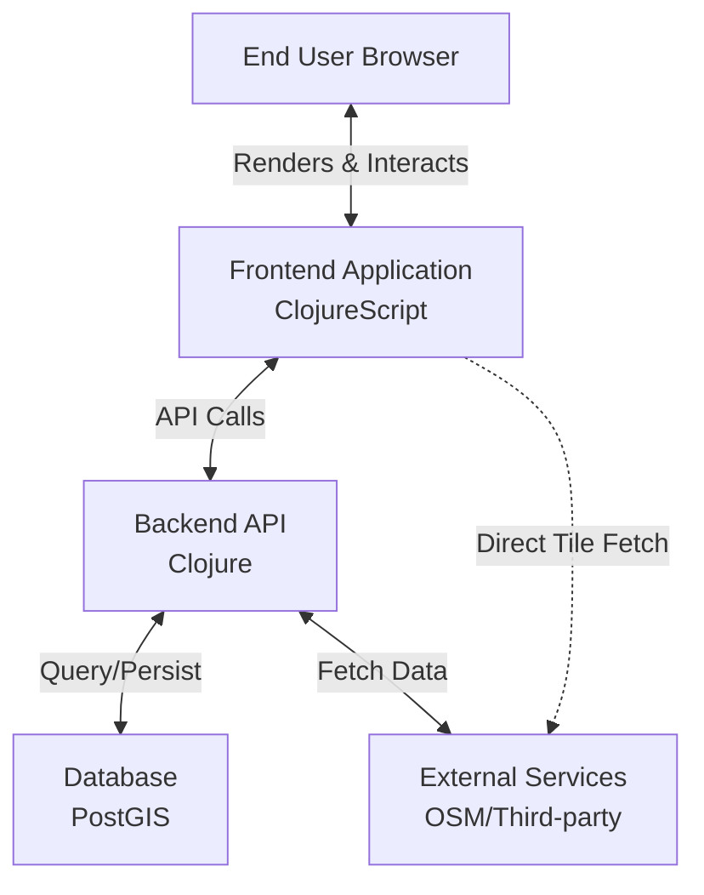
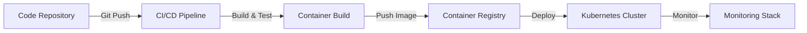

# Pearl-Map: 3D Web Mapping Platform 🌍

[English](README.md) | [中文](README_zh.md)

A high-performance, customizable 3D web mapping application built with Clojure and ClojureScript. Renders vector tiles and 3D terrain using MapLibre GL, powered by OpenStreetMap data, featuring a real-time style editor for dynamic visual customization.

## 📖 Overview

Pearl-Map delivers an immersive 3D geospatial visualization experience, enabling users to explore, analyze, and present location-based data through an intuitive interface. The platform combines powerful rendering capabilities with advanced customization tools.

## 🏗️ Architecture

### 1. Business Architecture

**Core Value Proposition**
Provide a high-performance, customizable 3D geospatial visualization platform that enables intuitive exploration, analysis, and presentation of location-based data.

**Key Capabilities**
- **🗺️ 3D Map Core Experience**: Fluid navigation (pan, zoom, tilt, rotate), 3D terrain rendering, building extrusion, and custom 3D model integration
- **🎨 Dynamic Style Editor**: Real-time visual customization through UI controls and code editor with live preview and theme sharing
- **📊 Data Integration & Visualization**: Seamless OpenStreetMap integration with support for GeoJSON and API-based geodata
- **🔍 Analysis & Querying**: Spatial feature querying, measurement tools, and future support for advanced spatial analysis

**User Roles**
- **👀 End Viewer**: Explore pre-configured maps and visualizations
- **✏️ Map Editor/Analyst**: Create and customize map views using style editing and data integration tools
- **⚙️ Administrator**: Manage users, system configuration, and backend services

### 2. Application Architecture

**Architecture Style**: Decoupled frontend-backend architecture

**Frontend (Single-Page Application)**
- **Technology Stack**: ClojureScript, Reagent, re-frame
- **Responsibilities**:
  - UI rendering using React/Reagent components
  - State management through unified app-db
  - Map rendering via MapLibre GL JS
  - Style editing with Monaco Editor integration
  - API communication through HTTP calls

**Backend (API Server)**
- **Technology Stack**: Clojure, Ring, Reitit, Integrant
- **Responsibilities**:
  - RESTful API gateway
  - Business logic and spatial query processing
  - Data access via PostgreSQL/PostGIS with next.jdbc
  - OSM integration and external service proxying

**Data Flow**


### 3. Technology Stack

| Component | Technology | Rationale |
|-----------|------------|-----------|
| **Frontend Framework** | ClojureScript, Reagent, re-frame | Immutable data flow for complex UI state, functional programming for maintainability |
| **Map Rendering** | MapLibre GL JS | Open-source WebGL support with 3D features and custom styling |
| **Style Editor** | Monaco Editor | Professional code editing experience for style JSON |
| **HTTP Client** | cljs-ajax/fetch | Robust API communication |
| **Frontend Build Tool** | shadow-cljs | Superior development experience with hot-reload and NPM integration |
| **Backend Build Tool** | deps.edn (Clojure CLI) | Official toolchain, lightweight and flexible, integrates well with shadow-cljs |
| **Backend Framework** | Clojure, Ring, Reitit, Integrant | High-performance JVM runtime with robust web stack |
| **Data Storage** | PostgreSQL + PostGIS | Industry standard for spatial data processing |
| **Data Formats** | JSON, EDN, MVT | Universal compatibility with native Clojure support |
| **Authentication** | Buddy | Mature security library with JWT support |
| **Deployment** | Docker, Nginx, JDK | Containerized environments for consistency |
| **Version Control** | Git | Standard version control system |

### Development Environment Setup

**Prerequisites**
- **Java Development Kit**: OpenJDK 17 (Required)
- Node.js 14+
- npm or yarn

**Note**: Pearl-Map requires OpenJDK 17 specifically. Other versions may not be fully compatible.

**Installation Steps**
1. **Install OpenJDK 17** (using Homebrew on macOS):
   ```bash
   brew install openjdk@17
   ```

2. **Verify Java installation**:
   ```bash
   java -version
   # Should show: openjdk version "17.x.x"
   ```

3. Install Clojure CLI tools

4. Install project dependencies:
   ```bash
   # Install JavaScript dependencies
   npm install
   ```

5. Start development environment:
   ```bash
   # Start frontend build and hot-reload
   npm run dev

   # Start backend REPL in another terminal
   clj -M:dev

   # Start static file server (for development)
   npm run serve
   ```

**Building for Production**
```bash
# Build frontend resources
npm run build

# Build backend Uberjar
clj -T:build uberjar
```

### 5. Deployment Architecture & Design

**Deployment Architecture Overview**

The deployment architecture follows a cloud-native approach with containerization and orchestration at its core. The system is designed for scalability, reliability, and maintainability.

**Infrastructure Components**
- **Infrastructure as Code**: Terraform for provisioning and managing cloud resources
- **Application Containers**: Docker containers for frontend and backend services
- **Orchestration**: Kubernetes for container management and scaling
- **Database**: Managed PostgreSQL with PostGIS extension
- **Object Storage**: For static assets and tile caching
- **CDN**: For global content delivery of static assets
- **Monitoring**: Prometheus for metrics, Grafana for visualization, and ELK stack for logging

**Deployment Pipeline**


**Infrastructure as Code with Terraform**

Pearl-Map uses Terraform to manage cloud infrastructure across multiple environments. This ensures consistent, reproducible infrastructure provisioning.

**Terraform Module Structure**
```
infrastructure/
├── modules/
│   ├── network/          # VPC, subnets, security groups
│   ├── database/         # RDS/Cloud SQL with PostGIS
│   ├── kubernetes/       # EKS/GKE cluster configuration
│   ├── storage/          # Object storage buckets
│   └── monitoring/       # Monitoring stack resources
├── environments/
│   ├── dev/              # Development environment
│   ├── staging/          # Staging environment
│   └── prod/             # Production environment
└── scripts/              # Terraform helper scripts
```

**Key Terraform Configurations**
```hcl
# Example: AWS EKS cluster module
module "eks_cluster" {
  source = "./modules/kubernetes"

  cluster_name    = "pearl-map-prod"
  cluster_version = "1.27"
  vpc_id          = module.network.vpc_id
  subnet_ids      = module.network.private_subnets

  node_groups = {
    general = {
      desired_size = 3
      max_size     = 10
      min_size     = 3
      instance_types = ["t3.medium"]
    }
  }
}
```

**Terraform Workflow**
1. **Plan Changes**: `terraform plan` to review infrastructure modifications
2. **Apply Changes**: `terraform apply` to provision resources
3. **State Management**: Remote state storage in S3/GCS with locking
4. **Module Reuse**: Shared modules across environments for consistency

**Production Deployment Options**

**Option 1: Traditional Server Deployment**
1. Build the application:
   ```bash
   # Build frontend
   npm run build

   # Build backend JAR
   clj -T:build uberjar
   ```
2. Set up a reverse proxy (Nginx) for static files and API routing
3. Configure environment variables for database connections and other services
4. Use process management (systemd, supervisord) to run the JAR file

**Option 2: Docker Container Deployment**
1. Create a Dockerfile for the backend service
2. Build and run using Docker Compose:
   ```bash
   # Example command to build and run
   docker-compose up -d --build
   ```
3. The docker-compose can include PostgreSQL, Nginx, and the application

**Option 3: Cloud Platform Deployment (Terraform Managed)**
- **AWS**: Terraform-managed EKS cluster with RDS PostgreSQL and S3
  ```bash
  cd infrastructure/environments/prod/aws
  terraform init
  terraform plan
  terraform apply
  ```
- **Google Cloud**: Terraform-managed GKE with Cloud SQL and Cloud Storage
  ```bash
  cd infrastructure/environments/prod/gcp
  terraform init
  terraform plan
  terraform apply
  ```
- **Azure**: Terraform-managed AKS with Azure Database for PostgreSQL and Blob Storage
  ```bash
  cd infrastructure/environments/prod/azure
  terraform init
  terraform plan
  terraform apply
  ```

**Kubernetes Deployment Configuration**

**Backend Deployment (example)**
```yaml
apiVersion: apps/v1
kind: Deployment
metadata:
  name: pearl-map-backend
spec:
  replicas: 3
  selector:
    matchLabels:
      app: pearl-map-backend
  template:
    metadata:
      labels:
        app: pearl-map-backend
    spec:
      containers:
      - name: backend
        image: pearl-map-backend:latest
        ports:
        - containerPort: 3000
        env:
        - name: DATABASE_URL
          valueFrom:
            secretKeyRef:
              name: pearl-map-secrets
              key: database-url
        - name: JWT_SECRET
          valueFrom:
            secretKeyRef:
              name: pearl-map-secrets
              key: jwt-secret
        resources:
          requests:
            memory: "256Mi"
            cpu: "250m"
          limits:
            memory: "512Mi"
            cpu: "500m"
        livenessProbe:
          httpGet:
            path: /health
            port: 3000
          initialDelaySeconds: 30
          periodSeconds: 10
```

**Service Mesh & Ingress**
- **Ingress Controller**: Nginx Ingress for routing external traffic
- **Service Mesh**: Istio for advanced traffic management and security
- **TLS Termination**: Automated SSL certificates with Let's Encrypt and cert-manager

**Monitoring & Observability**
- **Metrics Collection**: Prometheus operators for scraping metrics
- **Log Aggregation**: Fluentd -> Elasticsearch -> Kibana pipeline
- **Tracing**: Jaeger for distributed tracing
- **Alerting**: Alertmanager configured with Slack/PagerDuty integrations

**Environment Configuration**
Set the following environment variables for production:
```bash
# Database
DATABASE_URL=your_production_database_url
DB_POOL_SIZE=10

# Security
JWT_SECRET=your_secure_jwt_secret
JWT_EXPIRE_MINUTES=1440

# External Services
MAP_API_KEY=your_map_service_api_key
TILE_SERVER_URL=your_tile_server_url

# Performance
HTTP_MAX_THREADS=100
HTTP_PORT=3000

# Monitoring
PROMETHEUS_METRICS_PORT=9000
JAEGER_ENDPOINT=http://jaeger-collector:14268/api/traces
```

### 6. Development Roadmap

**Phase-Driven Strategy**: Focused on rapid validation, iterative enhancement, and strategic expansion

#### Phase 1: Web Frontend & 3D Core (Initial MVP)
- **🌐 Web Application Foundation**: Single-page application with core UI components
- **🏔️ 3D Rendering Engine**: MapLibre GL integration with OSM data sources
- **🎨 Basic Style Editor**: Real-time visual customization capabilities
- **🗺️ Core Navigation**: Pan, zoom, tilt, and rotate interactions
- **Direct OSM Integration**: Leverage OpenStreetMap services directly without custom backend

#### Phase 2: SDK Development & API Expansion
- **📦 SDK Architecture**: Design and develop client SDKs for various platforms
- **🔌 API Gateway**: Build robust backend services for advanced functionality
- **🗃️ Data Management**: Add support for custom data sources and storage
- **🌐 Multi-Source Integration**: Support for non-OSM data sources (WMS, WMTS, GeoJSON, etc.)
- **📱 Mobile SDKs**: Develop native SDKs for iOS and Android platforms
- **🌐 Web SDK**: Package core functionality as embeddable web components

#### Phase 3: Progressive Enhancement & Cross-Platform
- **📱 PWA Capabilities**: Add offline support, installation, and service workers
- **⚡ Performance Optimization**: Enhance loading speeds and rendering performance
- **🔬 Advanced Analysis Tools**: Add sophisticated spatial analysis capabilities
- **💻 Desktop Integration**: Extend to desktop environments and electron apps
- **🔄 Real-time Collaboration**: Multi-user editing and sharing features

**Visual Flow**: Phase 1 → Phase 2 → Phase 3

Each phase builds upon the previous work, ensuring continuous enhancement and expansion of capabilities while maintaining focus on core value delivery.

## 🎯 Conclusion

This development strategy follows a low-risk, high-iteration-speed approach. Each phase builds upon previous work, maximizing code reuse and leveraging the full potential of the Clojure/Script ecosystem. The hybrid mobile approach in Phase 3 provides the most efficient path to cross-platform presence.
