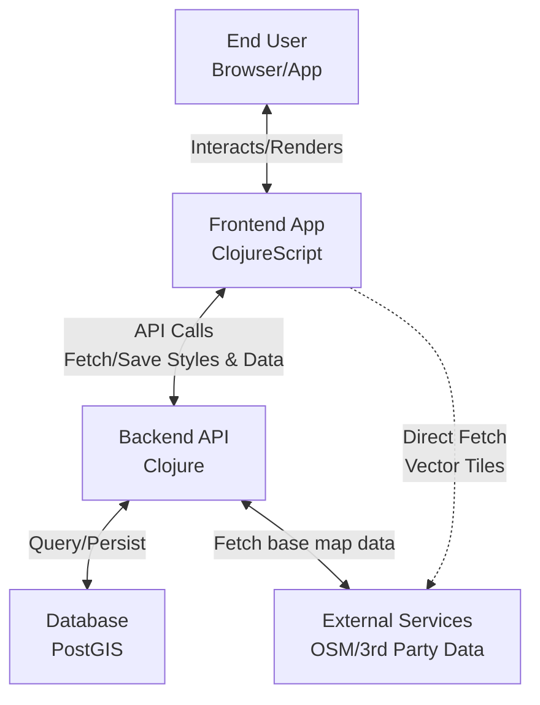
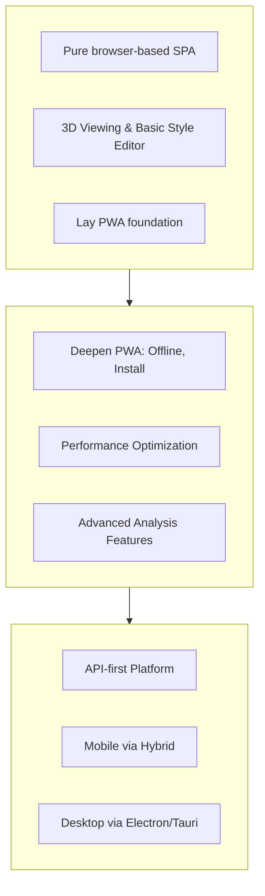

### **Pearl-Map: 3D Web Mapping Platform (Clojure/Script)**

A high-performance, styleable 3D web mapping application built with Clojure &amp; ClojureScript. Renders vector tiles and 3D terrain with MapLibre GL, powered by OpenStreetMap data, and features a real-time style editor.

Of course. Here is a comprehensive English version of the architecture overview, structured for an international or technical audience, with the evolution plan formatted as a clear roadmap.

---

### 1. Business Architecture

*   **Core Value Proposition:** To provide a high-performance, customizable **3D geospatial visualization platform** that enables users to intuitively explore, analyze, and present location-based data.
*   **Key Capabilities:**
    1.  **3D Map Core Experience:** Fluid navigation (pan, zoom, tilt, rotate), 3D terrain and building extrusion, custom 3D model integration.
    2.  **Dynamic Style Editor:** The core differentiating feature. Allows users to modify the map's visual appearance (colors, styles, layer visibility) in real-time via a UI or code editor, and save/share custom themes.
    3.  **Data Integration & Visualization:** Seamlessly integrates OpenStreetMap (OSM) as a base layer and supports user-uploaded or API-integrated geodata (e.g., GeoJSON) for display.
    4.  **Analysis & Querying:** Spatial feature querying, measurement, and future advanced spatial analysis (e.g., buffer zones, routing).
*   **Primary User Roles:**
    *   **End Viewer:** Consumes pre-configured maps for basic exploration.
    *   **Map Editor/Analyst:** Uses the style editor and data integration tools to create and configure map views for specific needs.
    *   **Administrator:** Manages users, system configuration, and backend services.

### 2. Application Architecture

A high-level design of how the system's components interact to deliver business capabilities.

*   **Overall Style:** Decoupled **frontend-backend** architecture.
*   **Frontend (Single-Page Application - SPA):**
    *   **Core Stack:** `ClojureScript` + `Reagent` + `re-frame`.
    *   **Responsibilities:**
        *   *Rendering:* React/Reagent components for all UI.
        *   *State Management:* Unified state tree (`app-db`) for application state (map view, UI state, user data, style config).
        *   *Map Engine:* `MapLibre GL JS` for all rendering and base interactions.
        *   *Style Editor:* A complex subsystem with form controls and/or a code editor (`Monaco`) for modifying the MapLibre style spec with live preview.
        *   *Communication:* HTTP calls to backend API.
*   **Backend (API Server):**
    *   **Core Stack:** `Clojure` + `Ring` + `Reitit` + `Integrant`.
    *   **Responsibilities:**
        *   *API Gateway:* A set of well-defined RESTful APIs.
        *   *Business Logic:* Complex spatial queries, data aggregation, style version management.
        *   *Data Access:* Interacts with `PostgreSQL/PostGIS` via `next.jdbc`.
        *   *OSM Integration:* Acts as a proxy/cache layer for external OSM services like Overpass API.
*   **Key Data Flows:**
    1.  The frontend loads the **initial style config** and **user data** from the backend.
    2.  The frontend fetches **map vector tiles** directly from dedicated tile servers (bypassing the backend for performance).
    3.  User style modifications are applied **in real-time** via the MapLibre API, with the final style JSON **saved** to the backend.
    4.  All CRUD operations on business data (users, saved styles, custom data) go through the backend API.

### 3. Technology Architecture

The concrete technologies, products, and services chosen to implement the application architecture.

| Layer | Technology Choices | Rationale |
| :--- | :--- | :--- |
| **Frontend Framework** | **ClojureScript**, **Reagent** (**React**), **re-frame** | Immutable data flow is perfect for complex UI state; Functional programming ensures high maintainability. |
| **Map Rendering** | **MapLibre GL JS** | Open-source, powerful, supports WebGL and 3D features (terrain, extrusion, custom styling). |
| **Style Editing** | **Monaco Editor** (VS Code core) | Professional code editing experience for advanced style JSON editing. |
| **HTTP Client** | `cljs-ajax` or `fetch` | Handles API communication. |
| **Build Tool** | **shadow-cljs** | Superior ClojureScript development experience with hot-reload, code splitting, and seamless NPM integration. |
| **Backend Framework** | **Clojure**, **Ring**, **Reitit** (Routing), **Integrant** (Lifecycle) | High-performance JVM; Powerful data transformation for geodata; Consistent web stack. |
| **Data Storage** | **PostgreSQL** + **PostGIS** | Stores relational data and is the **gold standard for processing spatial queries**. |
| **API Data Formats** | **JSON** / **EDN** / **MVT** (Vector Tiles) | JSON is universal, EDN is native to Clojure, MVT is the standard for vector tiles. |
| **Authn/Authz** | **Buddy** | Mature security library for Clojure, supports JWT, etc. |
| **Deployment** | **Docker** containers, **Nginx** (reverse proxy/static files), **JDK** | Containerization ensures environment consistency and easy deployment. |
| **DevOps** | **Git**, **CLI** tools (`lein`/`deps.edn`) | Standard source control and build tools. |

### 4. Development Roadmap

A phased strategy for development, focusing on rapid validation, iterative enhancement, and strategic expansion.

**Conclusion:** This roadmap follows a **low-risk, high-iteration-speed** strategy. Each phase builds upon the previous one, **maximizing code reuse** and leveraging the full power of the Clojure/Script stack. The decision to pursue a Hybrid mobile approach in Phase 3 is the most efficient path to achieving cross-platform presence.
