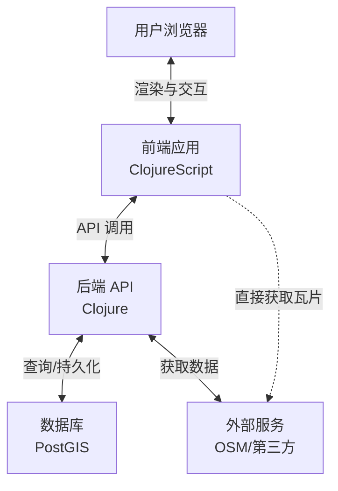
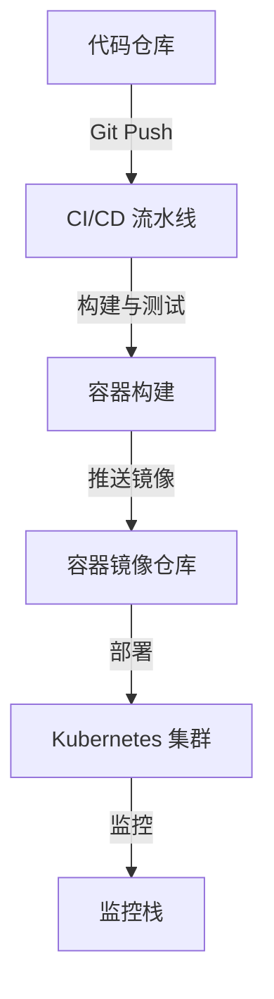

# Pearl-Map: 3D 网络地图平台 🌍

[English](README.md) | [中文](README_zh.md)

一个基于 Clojure 和 ClojureScript 构建的高性能、可定制的 3D 网络地图应用程序。使用 MapLibre GL 渲染矢量瓦片和 3D 地形，由 OpenStreetMap 数据驱动，并配备实时样式编辑器以实现动态视觉定制。

## 📖 概述

Pearl-Map 提供沉浸式的 3D 地理空间可视化体验，使用户能够通过直观的界面探索、分析和呈现基于位置的数据。该平台结合了强大的渲染能力和高级定制工具。

## 📁 项目结构

```
pearl-map/
├── .github/                                 # GitHub 工作流和 CI/CD 配置
│   └── workflows/                           # CI/CD 流水线定义
│       ├── ci.yml                           # 持续集成工作流 [待建]
│       ├── cd.yml                           # 持续部署工作流 [待建]
│       └── release.yml                      # 发布自动化工作流 [待建]
├── bin/                                     # 可执行脚本
│   ├── setup-dev                            # 开发环境设置脚本 [待建]
│   ├── deploy-prod                          # 生产环境部署脚本 [待建]
│   └── backup-db                            # 数据库备份脚本 [待建]
├── dev/                                     # 开发环境配置
│   └── user.clj                             # 开发用户配置 [待建]
├── doc/                                     # 项目文档
│   ├── deployment.md                        # 部署指南 [待建]
│   ├── api.md                               # API 文档 [待建]
│   ├── architecture.md                      # 架构概述 [待建]
│   └── contributing.md                      # 贡献指南 [待建]
├── infrastructure/                          # 基础设施即代码 [待建]
│   ├── modules/                             # Terraform 模块
│   │   ├── network/                         # VPC、子网、安全组
│   │   ├── database/                        # 带 PostGIS 的 RDS/Cloud SQL
│   │   ├── kubernetes/                      # EKS/GKE 集群配置
│   │   ├── storage/                         # 对象存储桶
│   │   └── monitoring/                      # 监控栈资源
│   └── environments/                        # 环境配置
│       ├── dev/                             # 开发环境
│       ├── staging/                         # 预发布环境
│       └── prod/                            # 生产环境
├── src/                                     # 源代码
│   ├── clj/                                 # 后端 Clojure 代码 [待建]
│   │   └── pearl_map/                       # 主命名空间
│   │       ├── core.clj                     # 核心功能 [待建]
│   │       ├── api/                         # API 处理器
│   │       │   ├── handlers.clj             # 请求处理器 [待建]
│   │       │   └── routes.clj               # API 路由 [待建]
│   │       ├── db/                          # 数据库层
│   │       │   ├── core.clj                 # 数据库核心 [待建]
│   │       │   └── queries.clj              # 数据库查询 [待建]
│   │       ├── config/                      # 配置管理
│   │       │   └── config.clj               # 配置处理 [待建]
│   │       ├── middleware/                  # 中间件
│   │       │   ├── auth.clj                 # 认证中间件 [待建]
│   │       │   ├── cors.clj                 # CORS 中间件 [待建]
│   │       │   └── logging.clj              # 日志中间件 [待建]
│   │       └── main.clj                     # 应用入口点 [待建]
│   ├── pearl_map/                           # 构建工具命名空间
│   │   └── build.clj                        # 构建任务和工具 [已存在]
│   └── cljs/                                # 前端 ClojureScript 代码
│       └── pearl_map/                       # 前端主命名空间
│           ├── core.cljs                    # 前端核心 [已存在]
│           ├── editor.cljs                  # 样式编辑器组件 [已存在]
│           ├── events.cljs                  # re-frame 事件 [待建]
│           ├── subs.cljs                    # re-frame 订阅 [待建]
│           ├── views/                       # React 组件
│           │   ├── map.cljs                 # 地图组件 [待建]
│           │   ├── editor.cljs              # 样式编辑器组件 [已存在]
│           │   ├── ui.cljs                  # UI 组件 [待建]
│           │   └── layout.cljs              # 布局组件 [待建]
│           ├── api.cljs                     # API 客户端 [待建]
│           └── services/                    # 前端服务
│               ├── map_engine.cljs          # 地图引擎封装 [待建]
│               └── threejs.cljs             # Three.js 集成 [待建]
├── resources/                               # 源代码资源文件（git 跟踪）
│   ├── config/                              # 配置文件 [待建]
│   │   ├── config.edn                       # 基础配置 [待建]
│   │   ├── dev.edn                          # 开发环境配置 [待建]
│   │   └── prod.edn                         # 生产环境配置 [待建]
│   ├── public/                              # 静态源资源
│   │   ├── index.html                       # HTML 模板 [已存在]
│   │   ├── css/                             # CSS 源样式
│   │   │   ├── maplibre-gl.css              # MapLibre 样式 [已存在]
│   │   │   └── style.css                    # 主样式表 [已存在]
│   │   └── models/                          # 3D 模型源资源 [部分实现]
│   │       └── eiffel_tower/                # 埃菲尔铁塔 3D 模型目录 [已存在]
│   │           ├── license.txt              # 模型许可证 [已存在]
│   │           ├── scene.bin                # 模型二进制文件 [已存在]
│   │           └── scene.gltf               # 模型 GLTF 文件 [已存在]
│   ├── sql/                                 # 数据库脚本 [待建]
│   │   └── migrations/                      # 数据库迁移
│   │       ├── 001-initial-schema.sql       # 初始数据库架构 [待建]
│   │       └── 002-add-spatial-data.sql     # 空间数据迁移 [待建]
│   └── data/                                # 示例数据 [待建]
│       ├── sample-geojson/                  # GeoJSON 示例数据
│       │   └── paris-landmarks.geojson      # 巴黎地标示例 [待建]
│       └── map-styles/                      # 地图样式示例
│           ├── dark-style.json              # 深色主题样式 [待建]
│           └── light-style.json             # 浅色主题样式 [待建]
├── test/                                    # 测试代码 [待建]
│   ├── clj/                                 # 后端测试
│   │   └── pearl_map/                       # 测试命名空间
│   │       ├── api/                         # API 测试
│   │       │   └── handlers_test.clj        # 处理器测试 [待建]
│   │       ├── db/                          # 数据库测试
│   │       │   └── core_test.clj            # 数据库核心测试 [待建]
│   │       └── integration/                 # 集成测试
│   │           └── api_integration_test.clj # API 集成测试 [待建]
│   └── cljs/                                # 前端测试
│       └── pearl_map/                       # 前端测试命名空间
│           ├── components/                  # 组件测试
│           │   └── map_test.cljs            # 地图组件测试 [待建]
│           └── services/                    # 服务测试
│               └── map_engine_test.cljs     # 地图引擎测试 [待建]
├── target/                                  # 最终构建输出和编译资产用于发布（git 排除）
├── .gitignore                               # Git 忽略规则 [已存在]
├── .editorconfig                            # 编辑器配置 [待建]
├── .nvmrc                                   # Node.js 版本 [已存在]
├── deps.edn                                 # Clojure 依赖 [已存在]
├── package.json                             # JavaScript 依赖 [已存在]
├── shadow-cljs.edn                          # ClojureScript 构建配置 [已存在]
├── docker-compose.yml                       # Docker 开发环境 [待建]
├── Dockerfile                               # 生产环境 Dockerfile [待建]
├── Makefile                                 # 构建脚本 [待建]
├── CHANGELOG.md                             # 变更日志 [待建]
├── README.md                                # 项目文档（英文）[已存在]
└── README_zh.md                             # 项目文档（中文）[已存在]
```

### 关键配置文件

- **`deps.edn`**: Clojure 后端依赖管理和构建配置
- **`shadow-cljs.edn`**: ClojureScript 前端构建和编译配置
- **`package.json`**: JavaScript 依赖和 NPM 脚本配置
- **`src/pearl_map/build.clj`**: 应用程序的构建任务和工具
- **`.gitignore`**: 项目的 Git 忽略规则

### 初始实现状态

初始实现专注于开发路线图的第一阶段，特别是以巴黎为重点的 MVP：

**已实现的核心功能：**
- ✅ 基本的 React/Reagent 组件结构，包含主页
- ✅ 集成 MapLibre GL JS 并支持多种样式
- ✅ 预配置埃菲尔铁塔坐标为中心点 (2.2945°E, 48.8584°N)
- ✅ 响应式地图容器，具有适当的样式
- ✅ 使用 Reagent atoms 进行地图实例状态管理
- ✅ 样式切换功能（基础/深色/浅色样式）
- ✅ 导航控件集成
- ✅ 比例尺控件集成
- ✅ 错误处理和调试工具
- ✅ OSM 栅格瓦片集成，支持德国镜像
- ✅ 实时建筑样式编辑器，支持颜色和透明度调整
- ✅ 建筑图层自动检测和应用样式
- ✅ 实时预览功能
- ✅ 热重载支持开发环境
- ✅ 埃菲尔铁塔 3D 模型加载（GLTF 格式） - 模型已加载
- ✅ Three.js 渲染基础设施设置
- ✅ 自定义 CSS 样式 UI 组件
- ✅ MapLibre CSS 集成

**当前技术状态：**
- 地图中心设置为埃菲尔铁塔坐标，缩放级别 15，45° 倾斜角度
- 支持多种地图样式：
  - ✅ 基础样式：OpenStreetMap 栅格瓦片（德国镜像） - 正常工作
  - ✅ 深色样式：Carto Dark Matter 矢量瓦片 - 正常工作（支持建筑样式编辑）
  - ✅ 浅色样式：Carto Positron 矢量瓦片 - 正常工作（支持建筑样式编辑）
- 建筑样式编辑器提供实时预览功能
- 支持填充颜色、轮廓颜色和透明度的实时调整
- 提供亮色和暗色主题的一键切换
- 完整的调试工具和图层信息查看
- 热重载支持开发环境
- 埃菲尔铁塔 3D 模型集成（GLTF 格式） - 已加载（Three.js 渲染基础设施已就位）
- 自定义 CSS 样式 UI 组件 - 已实现
- MapLibre CSS 集成 - 已实现
- 本地 Three.js 集成（无 CDN） - 已实现
- 从本地文件加载 GLTF 模型 - 已实现
- Three.js 文件复制的构建自动化 - 已实现
- Three.js GLTFLoader 集成 - 已实现
- 模型加载错误处理 - 已实现

**已添加的文件结构：**
```
src/
├── cljs/pearl_map/
│   ├── core.cljs              # 主应用程序入口点，包含完整地图功能
│   ├── editor.cljs            # 建筑样式编辑器组件（已实现）
│   └── （其他文件待添加）
└── pearl_map/
    └── build.clj              # 构建任务和工具（已实现）
resources/
├── public/
│   ├── css/
│   │   ├── maplibre-gl.css    # MapLibre 样式（已实现）
│   │   └── style.css          # 自定义样式（已实现）
│   ├── index.html             # HTML 模板（已实现）
│   └── models/
│       └── eiffel_tower/      # 埃菲尔铁塔 3D 模型（已实现）
│           ├── license.txt    # 模型许可证（已实现）
│           ├── scene.bin      # 模型二进制文件（已实现）
│           └── scene.gltf     # 模型 GLTF 文件（已实现）
```

**后续步骤：**
- 下一步：添加埃菲尔铁塔的 3D 模型集成（GLTF）
- 下一步：增强 UI 样式和布局
- 下一步：添加倾斜和旋转控件
- 下一步：扩展样式编辑器支持更多属性

## 🏗️ 架构

### 1. 业务架构

**核心价值主张**
提供一个高性能、可定制的 3D 地理空间可视化平台，支持直观地探索、分析和呈现基于位置的数据。

**关键能力**
- **🗺️ 3D 地图核心体验**: 流畅的导航（平移、缩放、倾斜、旋转）、3D 地形渲染、建筑物挤压和自定义 3D 模型集成
- **🎨 动态样式编辑器**: 通过 UI 控件和代码编辑器进行实时视觉定制，支持实时预览和主题共享
- **📊 数据集成与可视化**: 无缝集成 OpenStreetMap，支持 GeoJSON 和基于 API 的地理数据
- **🔍 分析与查询**: 空间要素查询、测量工具，以及未来对高级空间分析的支持

**用户角色**
- **👀 最终查看者**: 探索预配置的地图和可视化
- **✏️ 地图编辑者/分析师**: 使用样式编辑和数据集成工具创建和定制地图视图
- **⚙️ 管理员**: 管理用户、系统配置和后端服务

### 2. 应用架构

**架构风格**: 解耦的前端-后端架构

**前端（单页应用）**
- **技术栈**: ClojureScript, Reagent, re-frame
- **职责**:
  - 使用 React/Reagent 组件渲染 UI
  - 通过统一的 app-db 进行状态管理
  - 通过 MapLibre GL JS 进行地图渲染
  - 使用 Monaco Editor 集成进行样式编辑
  - 通过 HTTP 调用进行 API 通信

**后端（API 服务器）**
- **技术栈**: Clojure, Ring, Reitit, Integrant
- **职责**:
  - RESTful API 网关
  - 业务逻辑和空间查询处理
  - 通过 PostgreSQL/PostGIS 和 next.jdbc 进行数据访问
  - OSM 集成和外部服务代理

**数据流**


**数据流备注**: 第一阶段重点验证巴黎地区的埃菲尔铁塔GLTF模型集成，为第二阶段的全量3D模型管理系统奠定技术基础。初始实现包括核心地图设置（含埃菲尔铁塔坐标）和基础OSM集成。

### 3. 技术栈

| 组件 | 技术 | 理由 |
|-----------|------------|-----------|
| **前端框架** | ClojureScript, Reagent, re-frame | 不可变数据流处理复杂 UI 状态，函数式编程提高可维护性 |
| **地图渲染** | MapLibre GL JS | 开源 WebGL 支持，具有 3D 功能和自定义样式 |
| **3D 模型渲染** | Three.js + maplibre-gl-js-three | 高级 3D 模型支持，与 MapLibre 无缝集成，支持 GLTF/GLB 格式 |
| **3D 模型格式** | GLTF, GLB, 3D Tiles | 3D 地理空间数据的行业标准格式 |
| **样式编辑器** | Monaco Editor | 专业的代码编辑体验，用于样式 JSON |
| **HTTP 客户端** | cljs-ajax/fetch | 强大的 API 通信能力 |
| **前端构建工具** | shadow-cljs | 优越的开发体验，支持热重载和 NPM 集成 |
| **后端构建工具** | deps.edn (Clojure CLI) | 官方工具链，轻量灵活，与 shadow-cljs 集成良好 |
| **后端框架** | Clojure, Ring, Reitit, Integrant | 高性能 JVM 运行时，具有强大的 Web 栈 |
| **数据存储** | PostgreSQL + PostGIS | 空间数据处理的行业标准 |
| **数据格式** | JSON, EDN, MVT | 通用兼容性，支持原生 Clojure |
| **认证** | Buddy | 成熟的安全库，支持 JWT |
| **部署** | Docker, Nginx, JDK | 容器化环境确保一致性 |
| **基础设施即代码** | Terraform | 自动化云资源配置和管理 |
| **版本控制** | Git | 标准版本控制系统 |

### 4. 部署架构与设计

**部署架构概述**

部署架构遵循云原生方法，以容器化和编排为核心。系统设计注重可扩展性、可靠性和可维护性。

**基础设施组件**
- **基础设施即代码**: 使用 Terraform 配置和管理云资源
- **应用容器**: 用于前端和后端服务的 Docker 容器
- **编排**: Kubernetes 用于容器管理和扩展
- **数据库**: 托管式 PostgreSQL 带 PostGIS 扩展
- **对象存储**: 用于静态资源和瓦片缓存
- **CDN**: 用于静态资源的全球内容分发
- **监控**: Prometheus 用于指标收集，Grafana 用于可视化，ELK 栈用于日志记录

**部署流水线**


**使用 Terraform 的基础设施即代码**

Pearl-Map 使用 Terraform 来管理跨多个环境的云基础设施。这确保了基础设施配置的一致性和可重复性。

**Terraform 模块结构**
```
infrastructure/
├── modules/
│   ├── network/          # VPC、子网、安全组
│   ├── database/         # 带 PostGIS 的 RDS/Cloud SQL
│   ├── kubernetes/       # EKS/GKE 集群配置
│   ├── storage/          # 对象存储桶
│   └── monitoring/       # 监控栈资源
├── environments/
│   ├── dev/              # 开发环境
│   ├── staging/          # 预发布环境
│   └── prod/             # 生产环境
└── scripts/              # Terraform 辅助脚本
```

**关键 Terraform 配置**
```hcl
# 示例：AWS EKS 集群模块
module "eks_cluster" {
  source = "./modules/kubernetes"

  cluster_name    = "pearl-map-prod"
  cluster_version = "1.27"
  vpc_id          = module.network.vpc_id
  subnet_ids      = module.network.private_subnets

  node_groups = {
    general = {
      desired_size = 3
      max_size     = 10
      min_size     = 3
      instance_types = ["t3.medium"]
    }
  }
}
```

**Terraform 工作流程**
1. **计划变更**: `terraform plan` 查看基础设施修改
2. **应用变更**: `terraform apply` 配置资源
3. **状态管理**: 使用 S3/GCS 进行远程状态存储和锁定
4. **模块复用**: 跨环境共享模块以确保一致性

**生产环境部署选项**

**选项 1: 传统服务器部署**
1. 构建应用程序：
   ```bash
   # 构建前端
   npm run build

   # 构建后端 JAR
   clj -T:build uberjar
   ```
2. 设置反向代理（Nginx）用于静态文件和 API 路由
3. 配置数据库连接和其他服务的环境变量
4. 使用进程管理（systemd, supervisord）运行 JAR 文件

**选项 2: Docker 容器部署**
1. 为后端服务创建 Dockerfile
2. 使用 Docker Compose 构建和运行：
   ```bash
   # 构建和运行的示例命令
   docker-compose up -d --build
   ```
3. docker-compose 可以包含 PostgreSQL、Nginx 和应用程序

**选项 3: 云平台部署（Terraform 管理）**
- **AWS**: Terraform 管理的 EKS 集群，配合 RDS PostgreSQL 和 S3
  ```bash
  cd infrastructure/environments/prod/aws
  terraform init
  terraform plan
  terraform apply
  ```
- **Google Cloud**: Terraform 管理的 GKE，配合 Cloud SQL 和 Cloud Storage
  ```bash
  cd infrastructure/environments/prod/gcp
  terraform init
  terraform plan
  terraform apply
  ```
- **Azure**: Terraform 管理的 AKS，配合 Azure Database for PostgreSQL 和 Blob Storage
  ```bash
  cd infrastructure/environments/prod/azure
  terraform init
  terraform plan
  terraform apply
  ```

**Kubernetes 部署配置**

**后端部署（示例）**
```yaml
apiVersion: apps/v1
kind: Deployment
metadata:
  name: pearl-map-backend
spec:
  replicas: 3
  selector:
    matchLabels:
      app: pearl-map-backend
  template:
    metadata:
      labels:
        app: pearl-map-backend
    spec:
      containers:
      - name: backend
        image: pearl-map-backend:latest
        ports:
        - containerPort: 3000
        env:
        - name: DATABASE_URL
          valueFrom:
            secretKeyRef:
              name: pearl-map-secrets
              key: database-url
        - name: JWT_SECRET
          valueFrom:
            secretKeyRef:
              name: pearl-map-secrets
              key: jwt-secret
        resources:
          requests:
            memory: "256Mi"
            cpu: "250m"
          limits:
            memory: "512Mi"
            cpu: "500m"
        livenessProbe:
          httpGet:
            path: /health
            port: 3000
          initialDelaySeconds: 30
          periodSeconds: 10
```

**服务网格与入口**
- **入口控制器**: Nginx Ingress 用于路由外部流量
- **服务网格**: Istio 用于高级流量管理和安全
- **TLS 终止**: 使用 Let's Encrypt 和 cert-manager 实现自动化 SSL 证书

**监控与可观测性**
- **指标收集**: Prometheus operators 用于抓取指标
- **日志聚合**: Fluentd -> Elasticsearch -> Kibana 管道
- **追踪**: Jaeger 用于分布式追踪
- **告警**: Alertmanager 配置 Slack/PagerDuty 集成

**环境配置**
为生产环境设置以下环境变量：
```bash
# 数据库
DATABASE_URL=生产环境数据库URL
DB_POOL_SIZE=10

# 安全
JWT_SECRET=安全的JWT密钥
JWT_EXPIRE_MINUTES=1440

# 外部服务
MAP_API_KEY=地图服务API密钥
TILE_SERVER_URL=瓦片服务器URL

# 性能
HTTP_MAX_THREADS=100
HTTP_PORT=3000

# 监控
PROMETHEUS_METRICS_PORT=9000
JAEGER_ENDPOINT=http://jaeger-collector:14268/api/traces
```

### 5. 开发路线图

**分阶段策略**: 专注于快速验证、迭代增强和战略扩展

#### 第一阶段: Web 前端与 3D 核心（以巴黎为重点的 MVP） - 进行中
- **✅ Web 应用基础**: 具有核心 UI 组件的单页应用，专注于巴黎探索 - **已实现**
- **✅ 3D 渲染引擎**: 集成 MapLibre GL 并使用 OSM 数据源 - **已实现**（基础集成完成，包含 3D 模型支持）
- **✅ 埃菲尔铁塔演示**: 集成 GLTF 模型渲染，展示巴黎埃菲尔铁塔地标（48.8584° N, 2.2945° E） - **已实现**（坐标已设置，模型已加载并使用 Three.js 渲染）
- **✅ 基础样式编辑器**: 实时视觉定制能力 - **已实现**（建筑样式编辑器，支持颜色和透明度控制）
- **⏳ 核心导航**: 围绕巴黎的平移、缩放、倾斜和旋转交互 - **基础缩放/平移已实现，倾斜/旋转待完成**
- **✅ 直接 OSM 集成**: 直接使用 OpenStreetMap 服务 - **已实现**（使用 Maplibre 演示瓦片）

#### 第二阶段: SDK 开发与 API 扩展
- **📦 SDK 架构**: 设计和开发面向多平台的客户端 SDK
- **🔌 API 网关**: 构建强大的后端服务以支持高级功能
- **🗃️ 3D 模型管理系统**: 开发全面的 GLTF 模型加载、缓存和渲染系统
- **🌐 多源 3D 数据集成**: 支持从各种源批量摄入 3D 模型（GLTF、GLB、3D Tiles）
- **📱 移动 SDK**: 开发 iOS 和 Android 平台的原生 SDK，支持 3D 模型
- **🌐 Web SDK**: 将核心功能打包为可嵌入的 Web 组件，支持 3D 功能

#### 第三阶段: 渐进增强与跨平台
- **📱 PWA 能力**: 添加离线支持、安装和服务工作者
- **⚡ 性能优化**: 提升加载速度和渲染性能
- **🔬 高级分析工具**: 添加复杂的空间分析功能
- **💻 桌面集成**: 扩展到桌面环境和 Electron 应用
- **🔄 实时协作**: 多用户编辑和共享功能

**视觉流程**: 第一阶段 → 第二阶段 → 第三阶段

每个阶段都建立在之前工作的基础上，确保持续增强和扩展能力，同时专注于核心价值的交付。

**3D 模型状态更新：**
埃菲尔铁塔 GLTF 模型已成功加载并集成到项目结构中。Three.js 渲染基础设施已完全实现，采用本地文件集成（无 CDN 依赖）。构建过程现在自动将 Three.js 文件从 node_modules 复制到目标目录，确保 HTML 中的本地文件引用正确。模型加载机制功能正常，包含完善的错误处理，必要的构建过程确保所有资源正确部署。

**3D 集成后续步骤：**
- 完成 3D 模型相对于地图坐标的定位和缩放
- 实现 MapLibre 相机和 Three.js 相机之间的适当同步
- 添加用户控制以进行模型交互（旋转、缩放等）
- 优化渲染性能以实现平滑集成
- 实现 3D 模型在地图上的渲染和放置
- 添加模型加载状态指示器

## 🎯 结论

该开发策略遵循低风险、高迭代速度的方法。每个阶段都复用之前的代码，充分利用 Clojure/Script 生态系统的全部潜力。第三阶段的混合移动方法提供了最高效的跨平台覆盖路径。
