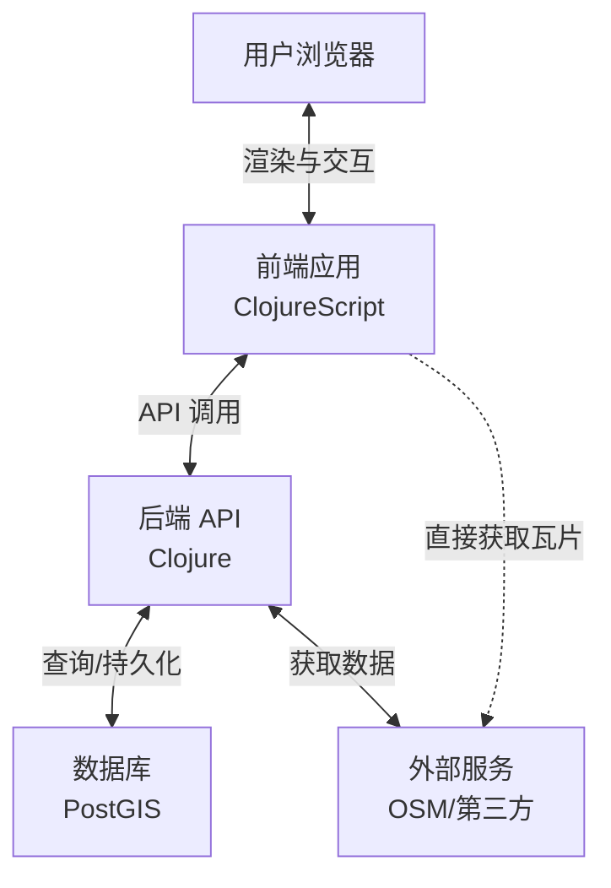
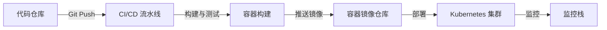

# Pearl-Map: 3D 网络地图平台 🌍

[English](README.md) | [中文](README_zh.md)

一个基于 Clojure 和 ClojureScript 构建的高性能、可定制的 3D 网络地图应用程序。使用 MapLibre GL 渲染矢量瓦片和 3D 地形，由 OpenStreetMap 数据驱动，并配备实时样式编辑器以实现动态视觉定制。

## 📖 概述

Pearl-Map 提供沉浸式的 3D 地理空间可视化体验，使用户能够通过直观的界面探索、分析和呈现基于位置的数据。该平台结合了强大的渲染能力和高级定制工具。

## 🏗️ 架构

### 1. 业务架构

**核心价值主张**
提供一个高性能、可定制的 3D 地理空间可视化平台，支持直观地探索、分析和呈现基于位置的数据。

**关键能力**
- **🗺️ 3D 地图核心体验**: 流畅的导航（平移、缩放、倾斜、旋转）、3D 地形渲染、建筑物挤压和自定义 3D 模型集成
- **🎨 动态样式编辑器**: 通过 UI 控件和代码编辑器进行实时视觉定制，支持实时预览和主题共享
- **📊 数据集成与可视化**: 无缝集成 OpenStreetMap，支持 GeoJSON 和基于 API 的地理数据
- **🔍 分析与查询**: 空间要素查询、测量工具，以及未来对高级空间分析的支持

**用户角色**
- **👀 最终查看者**: 探索预配置的地图和可视化
- **✏️ 地图编辑者/分析师**: 使用样式编辑和数据集成工具创建和定制地图视图
- **⚙️ 管理员**: 管理用户、系统配置和后端服务

### 2. 应用架构

**架构风格**: 解耦的前端-后端架构

**前端（单页应用）**
- **技术栈**: ClojureScript, Reagent, re-frame
- **职责**:
  - 使用 React/Reagent 组件渲染 UI
  - 通过统一的 app-db 进行状态管理
  - 通过 MapLibre GL JS 进行地图渲染
  - 使用 Monaco Editor 集成进行样式编辑
  - 通过 HTTP 调用进行 API 通信

**后端（API 服务器）**
- **技术栈**: Clojure, Ring, Reitit, Integrant
- **职责**:
  - RESTful API 网关
  - 业务逻辑和空间查询处理
  - 通过 PostgreSQL/PostGIS 和 next.jdbc 进行数据访问
  - OSM 集成和外部服务代理

**数据流**


### 3. 技术栈

| 组件 | 技术 | 理由 |
|-----------|------------|-----------|
| **前端框架** | ClojureScript, Reagent, re-frame | 不可变数据流处理复杂 UI 状态，函数式编程提高可维护性 |
| **地图渲染** | MapLibre GL JS | 开源 WebGL 支持，具有 3D 功能和自定义样式 |
| **样式编辑器** | Monaco Editor | 专业的代码编辑体验，用于样式 JSON |
| **HTTP 客户端** | cljs-ajax/fetch | 强大的 API 通信能力 |
| **前端构建工具** | shadow-cljs | 优越的开发体验，支持热重载和 NPM 集成 |
| **后端构建工具** | deps.edn (Clojure CLI) | 官方工具链，轻量灵活，与 shadow-cljs 集成良好 |
| **后端框架** | Clojure, Ring, Reitit, Integrant | 高性能 JVM 运行时，具有强大的 Web 栈 |
| **数据存储** | PostgreSQL + PostGIS | 空间数据处理的行业标准 |
| **数据格式** | JSON, EDN, MVT | 通用兼容性，支持原生 Clojure |
| **认证** | Buddy | 成熟的安全库，支持 JWT |
| **部署** | Docker, Nginx, JDK | 容器化环境确保一致性 |
| **版本控制** | Git | 标准版本控制系统 |

### 开发环境设置

**前置要求**
- Java Development Kit (JDK) 8+ (推荐 JDK 11 或 17 LTS)
- Node.js 14+
- npm 或 yarn

**安装步骤**
1. 确保已安装符合要求的 Java 版本：
   ```bash
   java -version
   ```
2. 安装 Clojure CLI 工具
3. 安装项目依赖：
   ```bash
   # 安装 JavaScript 依赖
   npm install
   ```
4. 启动开发环境：
   ```bash
   # 启动前端构建和热重载
   npm run dev

   # 在另一个终端启动后端 REPL
   clj -M:dev

   # 启动静态文件服务器（用于开发）
   npm run serve
   ```

**构建生产版本**
```bash
# 构建前端资源
npm run build

# 构建后端 Uberjar
clj -T:build uberjar
```

### 5. 部署架构与设计

**部署架构概述**

部署架构遵循云原生方法，以容器化和编排为核心。系统设计注重可扩展性、可靠性和可维护性。

**基础设施组件**
- **基础设施即代码**: 使用 Terraform 配置和管理云资源
- **应用容器**: 用于前端和后端服务的 Docker 容器
- **编排**: Kubernetes 用于容器管理和扩展
- **数据库**: 托管式 PostgreSQL 带 PostGIS 扩展
- **对象存储**: 用于静态资源和瓦片缓存
- **CDN**: 用于静态资源的全球内容分发
- **监控**: Prometheus 用于指标收集，Grafana 用于可视化，ELK 栈用于日志记录

**部署流水线**


**使用 Terraform 的基础设施即代码**

Pearl-Map 使用 Terraform 来管理跨多个环境的云基础设施。这确保了基础设施配置的一致性和可重复性。

**Terraform 模块结构**
```
infrastructure/
├── modules/
│   ├── network/          # VPC、子网、安全组
│   ├── database/         # 带 PostGIS 的 RDS/Cloud SQL
│   ├── kubernetes/       # EKS/GKE 集群配置
│   ├── storage/          # 对象存储桶
│   └── monitoring/       # 监控栈资源
├── environments/
│   ├── dev/              # 开发环境
│   ├── staging/          # 预发布环境
│   └── prod/             # 生产环境
└── scripts/              # Terraform 辅助脚本
```

**关键 Terraform 配置**
```hcl
# 示例：AWS EKS 集群模块
module "eks_cluster" {
  source = "./modules/kubernetes"

  cluster_name    = "pearl-map-prod"
  cluster_version = "1.27"
  vpc_id          = module.network.vpc_id
  subnet_ids      = module.network.private_subnets

  node_groups = {
    general = {
      desired_size = 3
      max_size     = 10
      min_size     = 3
      instance_types = ["t3.medium"]
    }
  }
}
```

**Terraform 工作流程**
1. **计划变更**: `terraform plan` 查看基础设施修改
2. **应用变更**: `terraform apply` 配置资源
3. **状态管理**: 使用 S3/GCS 进行远程状态存储和锁定
4. **模块复用**: 跨环境共享模块以确保一致性

**生产环境部署选项**

**选项 1: 传统服务器部署**
1. 构建应用程序：
   ```bash
   # 构建前端
   npm run build

   # 构建后端 JAR
   clj -T:build uberjar
   ```
2. 设置反向代理（Nginx）用于静态文件和 API 路由
3. 配置数据库连接和其他服务的环境变量
4. 使用进程管理（systemd, supervisord）运行 JAR 文件

**选项 2: Docker 容器部署**
1. 为后端服务创建 Dockerfile
2. 使用 Docker Compose 构建和运行：
   ```bash
   # 构建和运行的示例命令
   docker-compose up -d --build
   ```
3. docker-compose 可以包含 PostgreSQL、Nginx 和应用程序

**选项 3: 云平台部署（Terraform 管理）**
- **AWS**: Terraform 管理的 EKS 集群，配合 RDS PostgreSQL 和 S3
  ```bash
  cd infrastructure/environments/prod/aws
  terraform init
  terraform plan
  terraform apply
  ```
- **Google Cloud**: Terraform 管理的 GKE，配合 Cloud SQL 和 Cloud Storage
  ```bash
  cd infrastructure/environments/prod/gcp
  terraform init
  terraform plan
  terraform apply
  ```
- **Azure**: Terraform 管理的 AKS，配合 Azure Database for PostgreSQL 和 Blob Storage
  ```bash
  cd infrastructure/environments/prod/azure
  terraform init
  terraform plan
  terraform apply
  ```

**Kubernetes 部署配置**

**后端部署（示例）**
```yaml
apiVersion: apps/v1
kind: Deployment
metadata:
  name: pearl-map-backend
spec:
  replicas: 3
  selector:
    matchLabels:
      app: pearl-map-backend
  template:
    metadata:
      labels:
        app: pearl-map-backend
    spec:
      containers:
      - name: backend
        image: pearl-map-backend:latest
        ports:
        - containerPort: 3000
        env:
        - name: DATABASE_URL
          valueFrom:
            secretKeyRef:
              name: pearl-map-secrets
              key: database-url
        - name: JWT_SECRET
          valueFrom:
            secretKeyRef:
              name: pearl-map-secrets
              key: jwt-secret
        resources:
          requests:
            memory: "256Mi"
            cpu: "250m"
          limits:
            memory: "512Mi"
            cpu: "500m"
        livenessProbe:
          httpGet:
            path: /health
            port: 3000
          initialDelaySeconds: 30
          periodSeconds: 10
```

**服务网格与入口**
- **入口控制器**: Nginx Ingress 用于路由外部流量
- **服务网格**: Istio 用于高级流量管理和安全
- **TLS 终止**: 使用 Let's Encrypt 和 cert-manager 实现自动化 SSL 证书

**监控与可观测性**
- **指标收集**: Prometheus operators 用于抓取指标
- **日志聚合**: Fluentd -> Elasticsearch -> Kibana 管道
- **追踪**: Jaeger 用于分布式追踪
- **告警**: Alertmanager 配置 Slack/PagerDuty 集成

**环境配置**
为生产环境设置以下环境变量：
```bash
# 数据库
DATABASE_URL=生产环境数据库URL
DB_POOL_SIZE=10

# 安全
JWT_SECRET=安全的JWT密钥
JWT_EXPIRE_MINUTES=1440

# 外部服务
MAP_API_KEY=地图服务API密钥
TILE_SERVER_URL=瓦片服务器URL

# 性能
HTTP_MAX_THREADS=100
HTTP_PORT=3000

# 监控
PROMETHEUS_METRICS_PORT=9000
JAEGER_ENDPOINT=http://jaeger-collector:14268/api/traces
```

### 6. 开发路线图

**分阶段策略**: 专注于快速验证、迭代增强和战略扩展

#### 第一阶段: Web 应用基础（核心 MVP）
- **🌐 基于浏览器的 SPA**: 功能齐全的单页应用
- **🏔️ 3D 查看与基本编辑器**: 核心 3D 可视化及基本编辑功能
- **📱 PWA 基础**: 渐进式 Web 应用基础设施设置

#### 第二阶段: 产品增强（增强型 PWA）
- **📴 离线支持与安装**: 启用离线使用和应用安装
- **⚡ 性能优化**: 提升加载速度和渲染性能
- **🔬 高级分析工具**: 添加复杂的空间分析功能

#### 第三阶段: 跨平台扩展（平台扩展）
- **🔌 API 优先平台**: 开发全面的 API 以支持第三方集成
- **📱 移动混合应用**: 使用混合方法扩展到 iOS 和 Android
- **💻 桌面应用**: 原生桌面应用版本

**视觉流程**: 第一阶段 → 第二阶段 → 第三阶段

每个阶段都建立在之前工作的基础上，确保持续增强和扩展能力。

## 🎯 结论

该开发策略遵循低风险、高迭代速度的方法。每个阶段都复用之前的代码，充分利用 Clojure/Script 生态系统的全部潜力。第三阶段的混合移动方法提供了最高效的跨平台覆盖路径。
